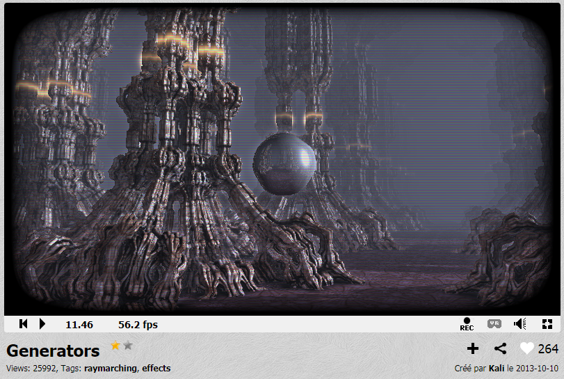
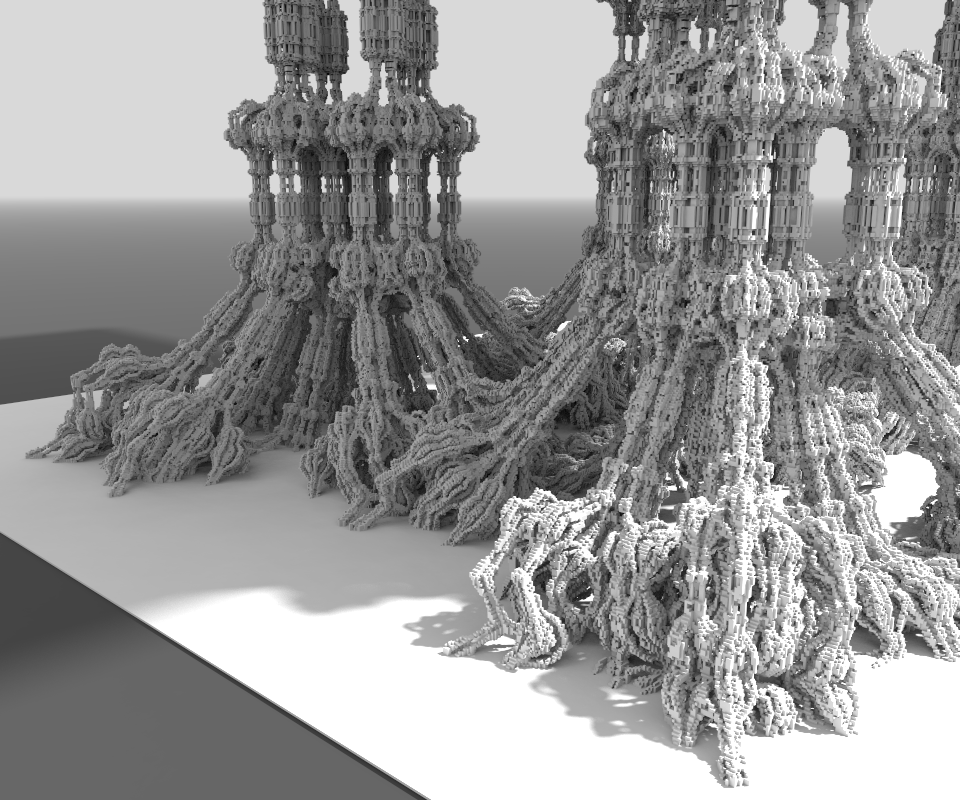
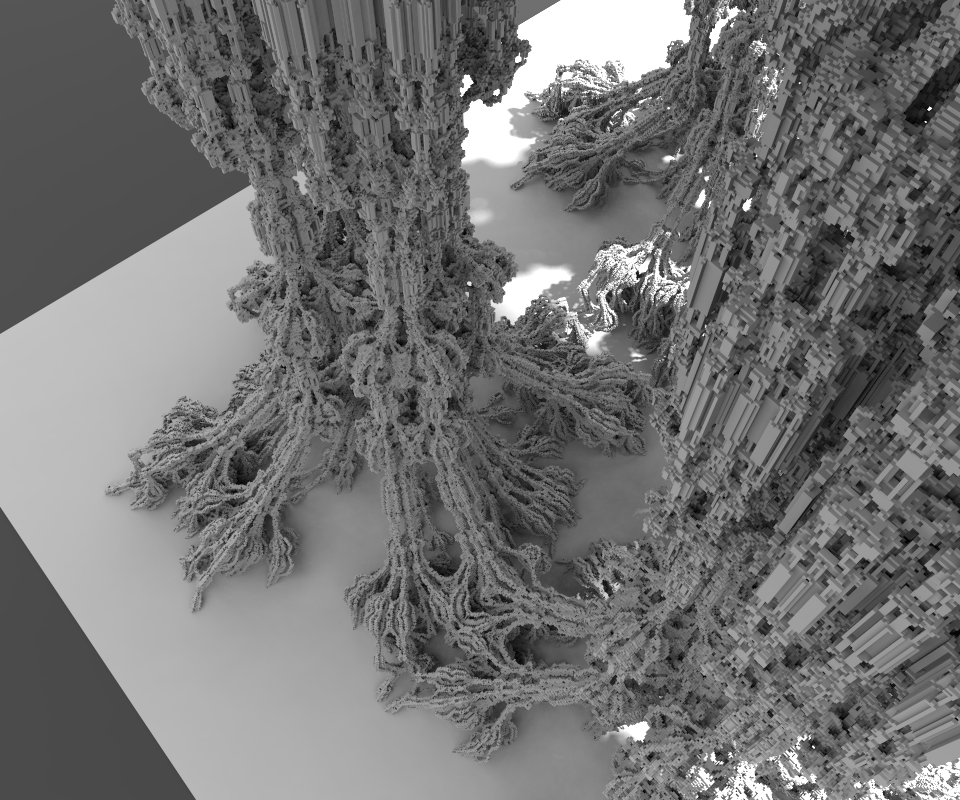
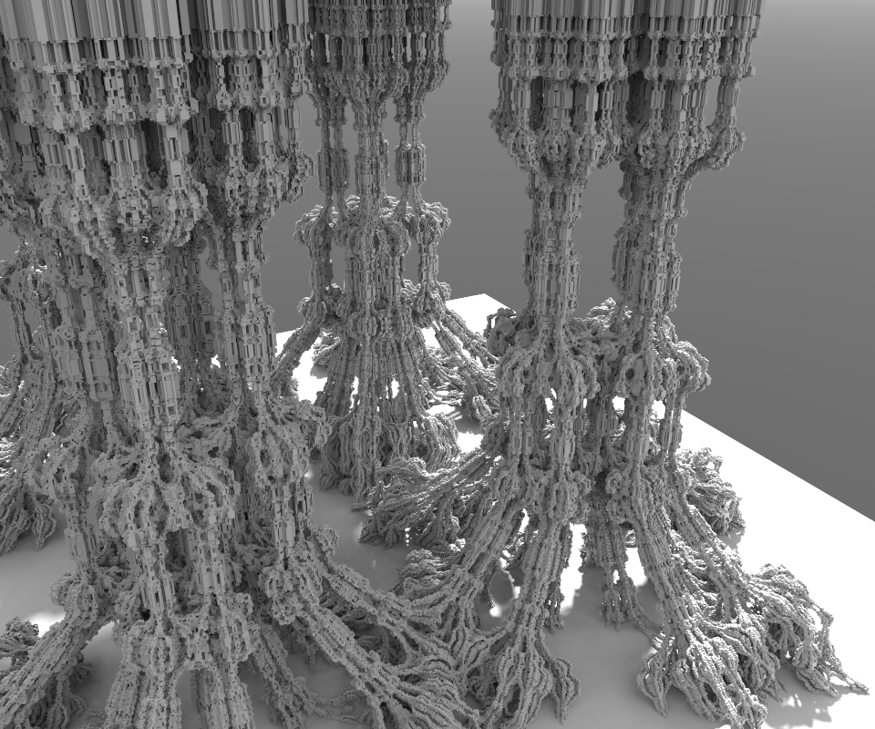
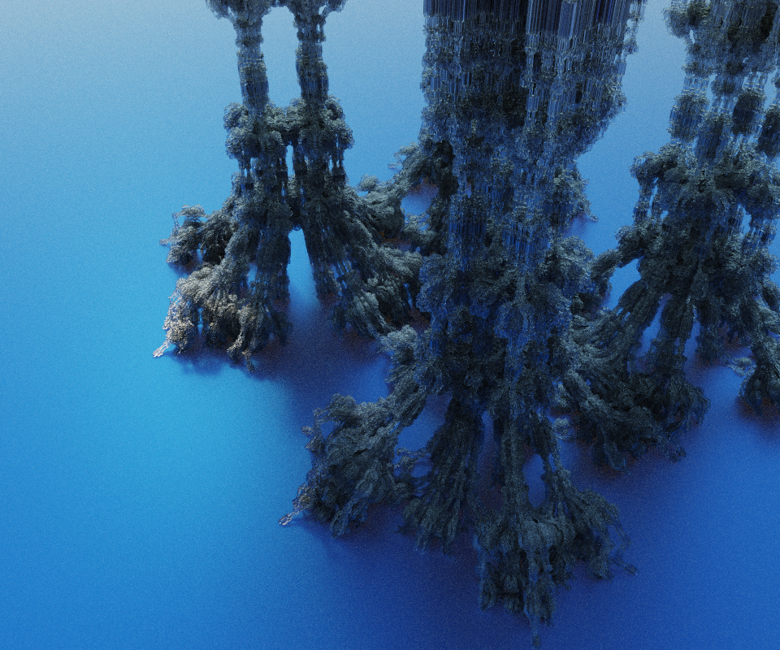

Meshed with SdfMesher 0.0.6540 (twitter:https://twitter.com/search?q=sdfmesher&src=typd) from a shader

Original Shader Link : https://www.shadertoy.com/view/Xtf3Rn

Author : Kali  (shadertoy:https://www.shadertoy.com/user/Kali)

Model : 11M of voxels, many cubes of 100 x 100 x 100

Glsl file used by SdfMesher : Generators_Kali.glsl 

the mains difficult things, as usual was to understand code :)
and extract, only df, normal, and color for a voxel pos. 
so many effect of the original shader are ignored.
and for now i cant export colors to MagicalVoxel, 
because quantization from 32M to 256 colors not work as expected.

