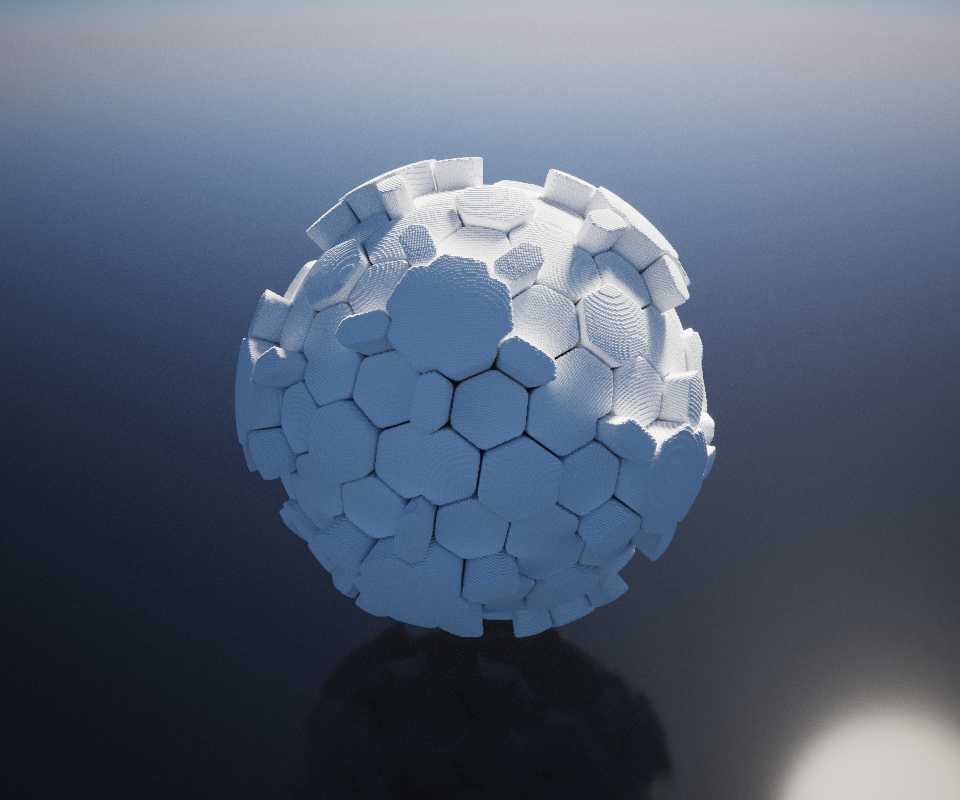
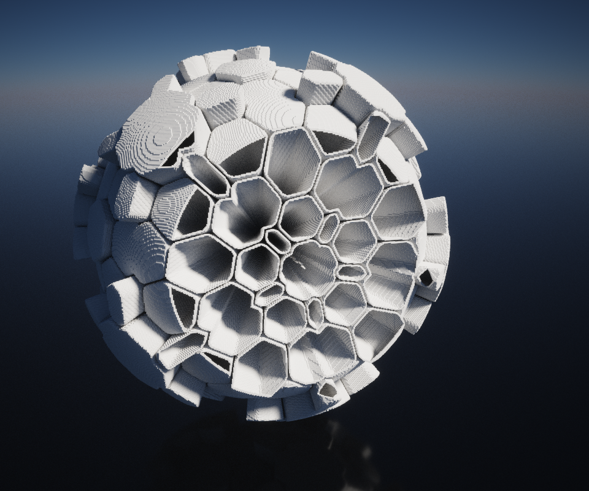
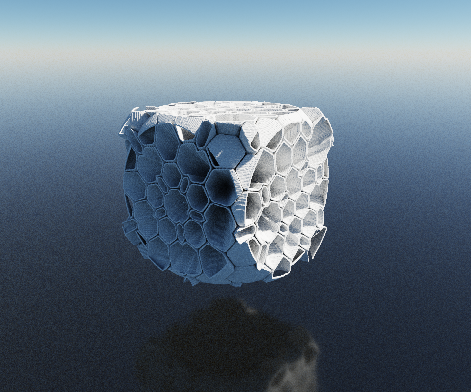
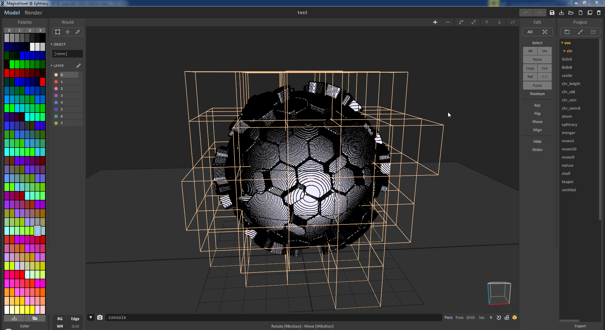

Meshed with SdfMesher 0.0.6540 (twitter:https://twitter.com/search?q=sdfmesher&src=typd) from a shader

Original Shader Link : https://www.shadertoy.com/view/llVXRd

Author : Thomas Hooper (twitter:https://twitter.com/tdhooper)

Model : 5M of Voxels, many cubes of 100 x 100 x 100

