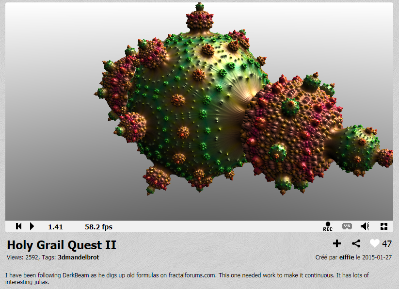

Meshed with SdfMesher 0.0.6540 (twitter:https://twitter.com/search?q=sdfmesher&src=typd) from a shader

Original Shader Link : https://www.shadertoy.com/view/MtfGWM

Author : Effie  (shadertoy:https://www.shadertoy.com/user/eiffie)

Model : many cubes of 100 x 100 x 100

Glsl file used by SdfMesher : Holy_Grail_Quest_II.glsl 

