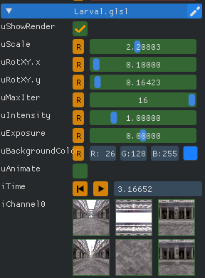
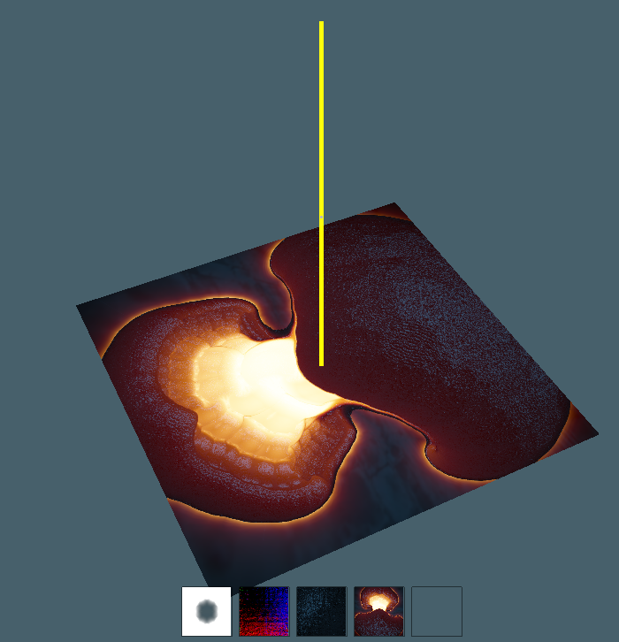

Meshed with SdfMesher 0.0.6540 (twitter:https://twitter.com/search?q=sdfmesher&src=typd) from a shader

Original Shader Link : https://www.shadertoy.com/view/ldB3Rz

Author : P_Malin (https://twitter.com/P_Malin)

The uniforms are :

uniform samplerCube(cube00_0.jpg:cube00_1.jpg:cube00_2.jpg:cube00_3.jpg:cube00_4.jpg:cube00_5.jpg) iChannel0;

Time widget
 
uniform float(time) iTime;

Sliders

uniform vec2(0.0,0.0:5.0,5.0:1.0,1.0) uRotXY;
uniform float(0.0:5.0:1.0) uIntensity;
uniform float(-6.0:6.0:0.0) uExposure;
uniform float(0.0:5.0:3.5) uScale;
uniform int(1:16:16) uMaxIter;

Color widget
uniform vec3(color:0.1,0.5,1.0) uBackgroundColor;

CheckBox : true is > to 0.5, false < to 0.5

uniform float(checkbox) uAnimate;
uniform float(checkbox) uShowRender;

The uniform look like this in SdfMesher :

The uniform uShowRender, is for show the preview, for select the good pos. 
better ton uncheck during meshing, for have less shader cost, and decrease total time

