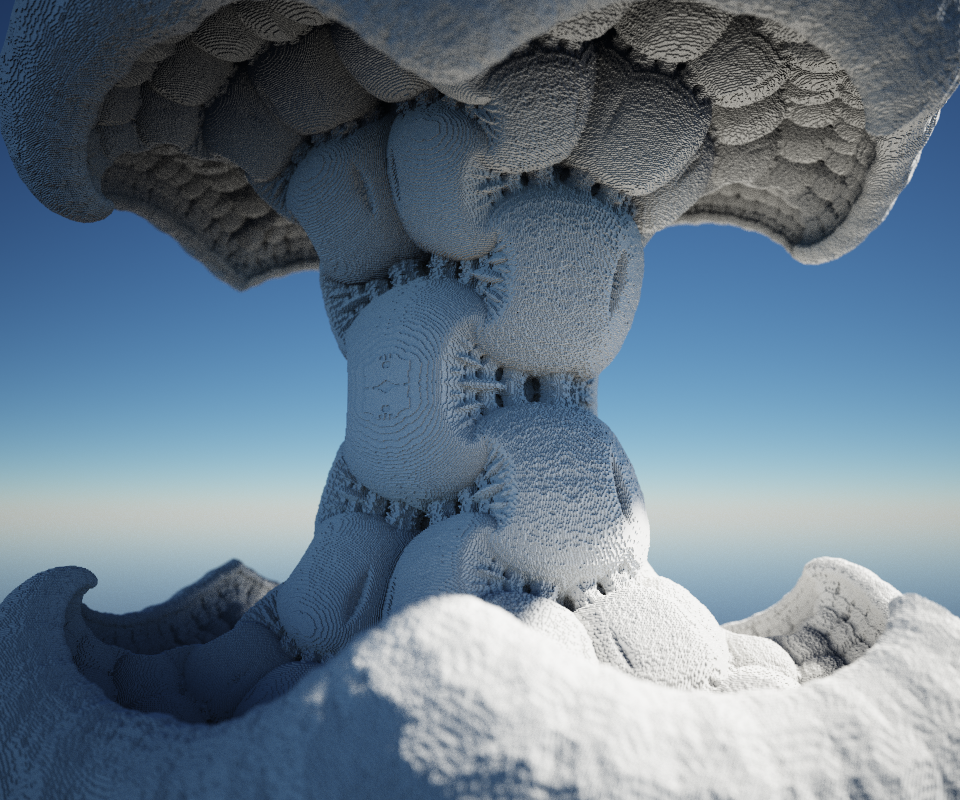
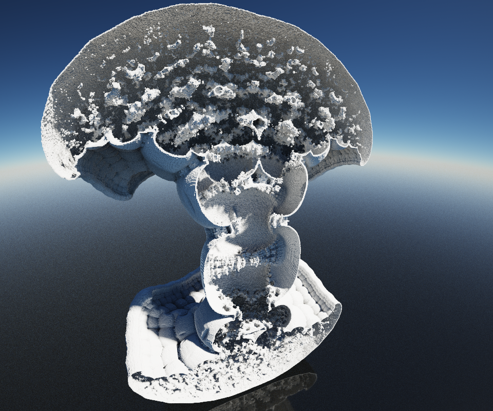
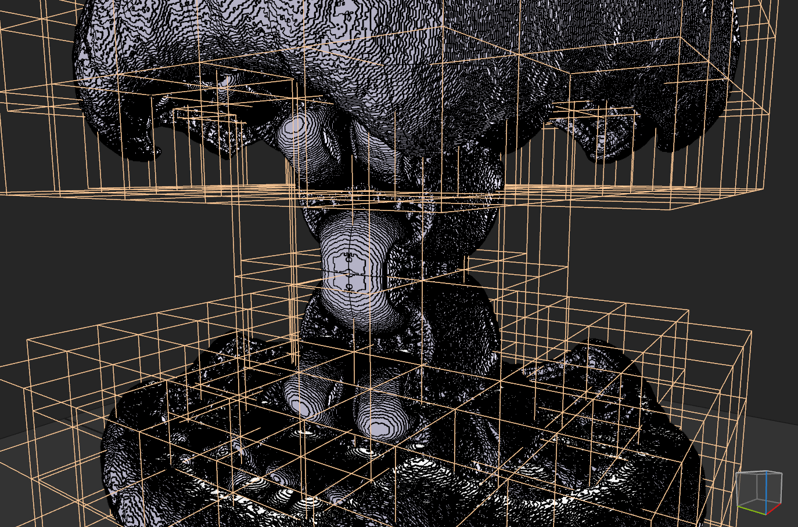

Meshed with SdfMesher 0.0.6540 (twitter:https://twitter.com/search?q=sdfmesher&src=typd) from a shader

Original Shader Link : https://www.shadertoy.com/view/ldB3Rz

Author : P_Malin (https://twitter.com/P_Malin)

Model : 6M of Voxels, many cubes of 100 x 100 x 100

Renders :

Interior :

In Model view :

