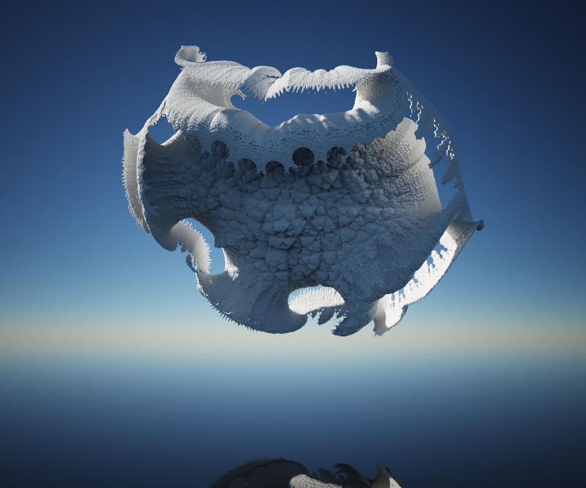

Meshed with SdfMesher 0.0.6540 (twitter:https://twitter.com/search?q=sdfmesher&src=typd) from a shader

Original Shader Link : https://www.shadertoy.com/view/MtKyWd

Author : Stb  (https://www.shadertoy.com/user/stb)

Model of 2M of Voxels, many cubes of 100 x 100 x 100 at time 279.5

Model of 16M of Voxels, many cubes of 100 x 100 x 100 at time 288.5

