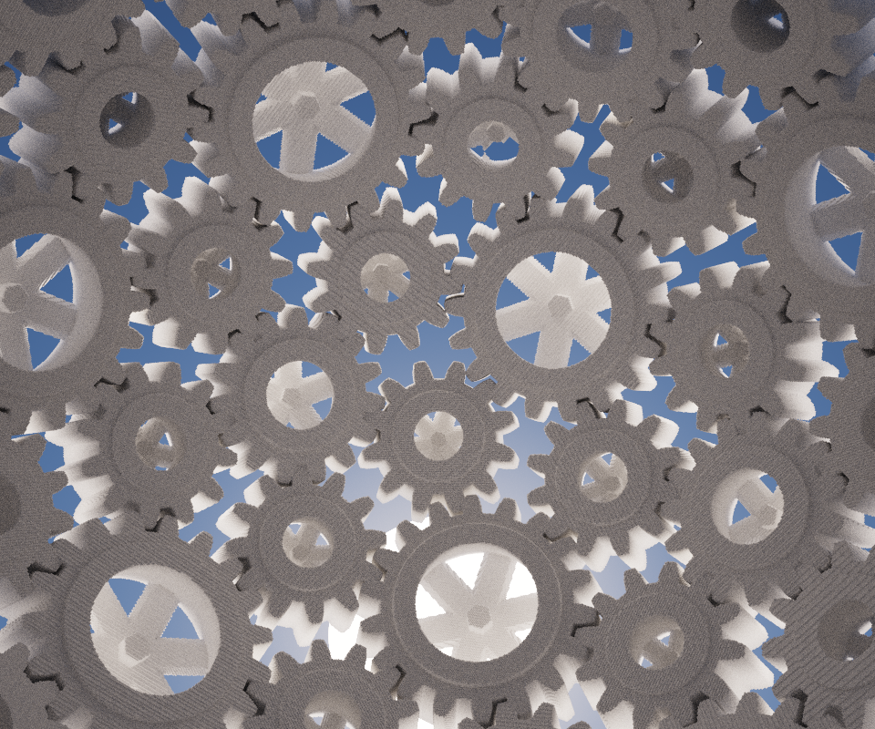

Meshed with SdfMesher 0.0.6540 (twitter:https://twitter.com/search?q=sdfmesher&src=typd) from a shader

Original Shader Link : https://www.shadertoy.com/view/lt3cz7

Author : Shane (https://www.shadertoy.com/user/Shane / www.Labyrinth.com)

Model : 86M of Voxels, many cubes of 100 x 100 x 100

In SdfMesher, the slicing volume was 1000 x 1000 x 1000. 

Can be at max 4096, but my system can't generate this shader in 4096 i thinck

